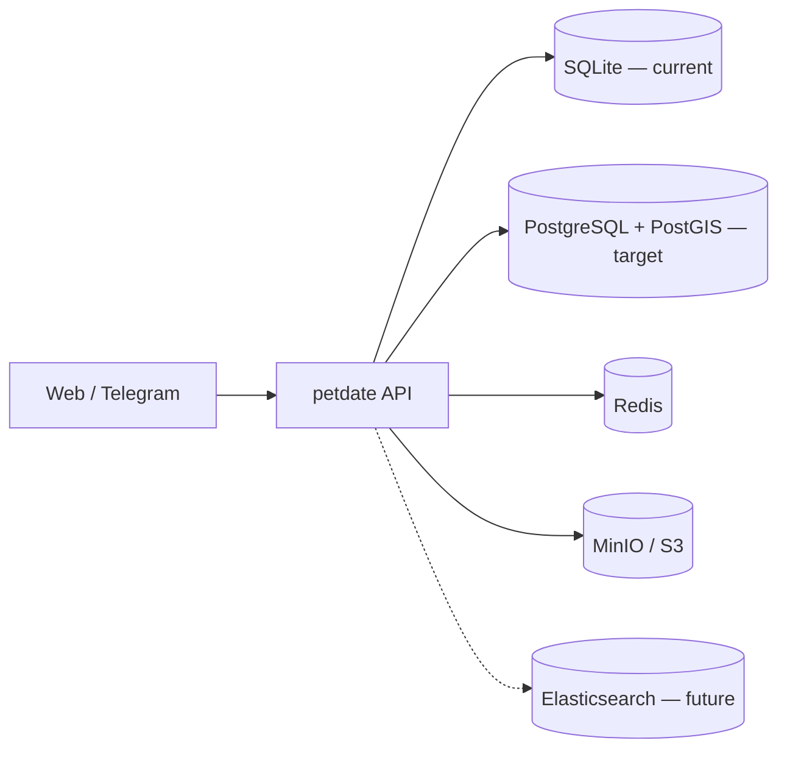

# Petdate Backend Architecture

Petdate is a pet playmate matching platform. This document describes the target backend infrastructure stack, how services interact, and the phased rollout plan.

## Stack Overview

| Service | Technology | Role |
|---------|------------|------|
| Main database | PostgreSQL + PostGIS | Users, pets, matches, games, sections; geospatial queries for nearby pets |
| Cache / realtime | Redis | Session cache, online presence, match queue, rate limiting |
| Object storage | S3-compatible (MinIO locally) | Pet images and media backups |
| Advanced search | Elasticsearch *(future)* | Full-text and faceted search across profiles and listings |

The API currently runs on **SQLite** for local development and Phase 1 UI work. PostgreSQL and the other services are provisioned via Docker Compose and will be adopted incrementally without removing SQLite until migration is complete.

## Service Roles

### PostgreSQL + PostGIS

- **Primary data store** for durable application state.
- **PostGIS extension** on the same instance powers location-based features: nearby pets, distance sorting, geofenced sections.
- Schema migrations and ORM access will target `DATABASE_URL` when the Postgres path is enabled.

### Redis

- **Low-latency layer** for data that changes often or must be shared across API instances.
- Planned uses: online/offline status, match-making queues, short-lived caches, pub/sub for realtime notifications.

### MinIO / S3

- **Image and file storage** for pet photos and uploads.
- Local development uses MinIO (S3-compatible API on port 9000; console on 9001).
- Production will point at AWS S3 or another S3-compatible provider using the same env vars.

### Elasticsearch *(future — optional `search` profile)*

- **Advanced search** when simple SQL/PostGIS filters are not enough.
- Not required for Phase 1–2; enable with `docker compose --profile search up -d` when building search features.

## Data Flow

1. **Client** (web app or Telegram bot) calls the Express API.
2. **API** reads/writes core entities. Today: SQLite file (`DATABASE_PATH`). Target: PostgreSQL via `DATABASE_URL`.
3. **Redis** is consulted for fast paths (presence, queues, cache) once wired in.
4. **S3/MinIO** stores binary assets; the API stores object keys/URLs in the database.
5. **Elasticsearch** *(later)* indexes searchable documents synced from Postgres for complex queries.

## Environment Configuration

Configuration is loaded from the repo root `.env` (see `.env.example`). Infrastructure-related variables are centralized in `packages/api/src/config/infra.ts`:

- `DATABASE_URL` — PostgreSQL connection string
- `REDIS_URL` — Redis connection string
- `S3_*` — endpoint, credentials, bucket, region
- `ELASTICSEARCH_URL` — optional, for the search profile

SQLite continues to use `DATABASE_PATH` when `DATABASE_URL` is unset.

## Phase Plan

### Phase 1 — UI & SQLite API *(current)*

- Web UI and Telegram flows against the existing SQLite-backed API.
- Docker infra can be started locally to prepare for Phase 2 without changing runtime behavior.

### Phase 2 — PostgreSQL + PostGIS

- Migrate schema and data access from SQLite to PostgreSQL.
- Enable PostGIS for location/nearby features.
- Keep Redis and S3 integration minimal (health checks, image upload path).

### Phase 3 — Redis & realtime

- Online presence, match queues, caching, and optional pub/sub.

### Phase 4 — S3 production path

- Harden uploads, CDN URLs, lifecycle policies; swap MinIO for cloud S3 in production.

### Phase 5 — Elasticsearch *(future)*

- Index profiles/listings; advanced search UI and APIs.
- Run Elasticsearch only via Compose profile `search` until production search cluster is defined.

## Local Infrastructure

See [infra/local-setup.md](./infra/local-setup.md) for Persian quick-start: `npm run infra:up`, env copy, and optional search profile.
